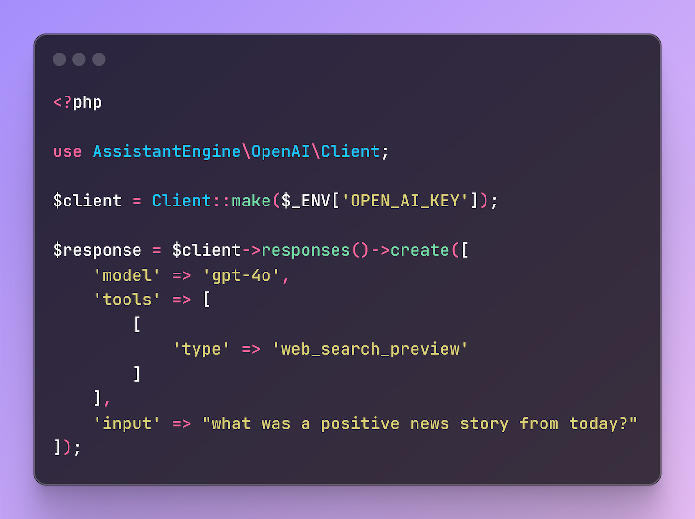

<div align="center">



</div>


# Experimental PHP OpenAI Responses Client

This is an **experimental** PHP client for the new **OpenAI Responses API**. It implements the `create`, `find`, and `delete` methods from the API, returning mapped response objects for seamless integration.

The goal of this experimental client is to provide a quick, easy-to-use library that allows you to experiment with the new endpoints from early on.

## Installation
Install the package via Composer:

```bash
composer require assistant-engine/php-openai-client
```

## Usage

### Conversation State

```php
use AssistantEngine\OpenAI\Client;

$client = Client::make($_ENV['OPEN_AI_KEY']);

$response = $client->responses()->create([
    'model' => 'gpt-4o',
    'input' => "Can you recommend me what I can eat today?"
]);

print_r($response->getOutputText());

$response2 = $client->responses()->create([
    'model' => 'gpt-4o',
    'previous_response_id' => $response->id,
    'input' => "maybe Pizza?",
]);

print_r($response2->getOutputText());

```

### File Search

```php
use AssistantEngine\OpenAI\Client;

$client = Client::make($_ENV['OPEN_AI_KEY']);

$response = $client->responses()->create([
    'model' => 'gpt-4o',
    'tools' => [
        [
            'type' => 'file_search',
            "vector_store_ids" => ["vs_123456789"]
        ]
    ],
    'input' => "when is the event in berlin happening?"
]);

print_r($response->getOutputText());
```

### Web Search

```php
use AssistantEngine\OpenAI\Client;

$client = Client::make($_ENV['OPEN_AI_KEY']);

$response = $client->responses()->create([
    'model' => 'gpt-4o',
    'tools' => [
        [
            'type' => 'web_search_preview'
        ]
    ],
    'input' => "what was a positive news story from today?"
]);

print_r($response->getOutputText());
```

### Computer Use

```php
use AssistantEngine\OpenAI\Client;

$client = Client::make($_ENV['OPEN_AI_KEY']);

// Path to your image file
$imageFilePath = './path/to/browser_screenshot.png';

// Read the image file contents
$imageData = file_get_contents($imageFilePath);

// Base64 encode the image data
$base64Image = base64_encode($imageData);

$response = $client->responses()->create([
    'model' => 'computer-use-preview',
    'tools' => [
        [
            'type' => 'computer_use_preview',
            "display_width" => 1024,
            "display_height" => 768,
            "environment" => "browser"
        ]
    ],
    'input' => [
        [
            "role" => "user",
            "content" => [
                [
                    "type" => "input_text",
                    "text" => "Can you find me products in sale?"
                ],
                [
                    "type" => "input_image",
                    "image_url" => "data:image/png;base64," . $base64Image
                ]
            ]
        ],

    ],
    "truncation" => "auto"
]);

print_r($response);
```
### List input items

```php
use AssistantEngine\OpenAI\Client;

$client = Client::make($_ENV['OPEN_AI_KEY']);
// Define query parameters for pagination and ordering
$params = [
    'after'  => 'item-id-to-start-after',  // Optional: list items after this ID
    'limit'  => 50,                        // Optional: limit number of items (default is 20)
    'order'  => 'desc',                    // Optional: order items in descending order
];

$respId = "resp_123456789";
$list = $client->responses()->inputItems()->list($respId, $params);

print_r($list);
```

Please note that this is an experimental client with the purpose to give you a fast possibility to explore the new OpenAI responses API with PHP. Please expect bugs and that not every feature from the new API is implemented.

## More Repositories

We’ve created more repositories to make AI integration even simpler and more powerful! Check them out:

- **[Open Functions Core](https://github.com/AssistantEngine/open-functions-core)**: Powerful primitives that simplify LLM calling and ready-to-use integrations for popular platforms such as Slack, GitHub, Bitbucket, Trello, and Jira Service Desk.
- **[Filament Assistant](https://github.com/AssistantEngine/filament-assistant)**: Add conversational AI capabilities directly into Laravel Filament.

> We are a young startup aiming to make it easy for developers to add AI to their applications. We welcome feedback, questions, comments, and contributions. Feel free to contact us at [contact@assistant-engine.com](mailto:contact@assistant-engine.com).


## Consultancy & Support

Do you need assistance integrating AI into your PHP applications, or help setting it up?  
We offer consultancy services to help you get the most out of our packages, whether you’re just getting started or looking to optimize an existing setup.

Reach out to us at [contact@assistant-engine.com](mailto:contact@assistant-engine.com).

## Contributing

We welcome contributions from the community! Feel free to submit pull requests, open issues, and help us improve the package.

## License

This project is licensed under the MIT License. Please see [License File](LICENSE.md) for more information.

